# IMMerge

## Introduction

**IMMerge** is a portable application that allows you to send personalised messages to multiple recipients using [WhatsApp Web](https://web.whatsapp.com). IMMerge works on Windows, macOS, and Linux operating systems.

IMMerge a third-party application and is not affiliated with WhatsApp.

## Note on Antivirus Software

IMMerge is a multi-platform application written in [Python](https://www.python.org), a popular programming language. Additionally, we use [Selenium](https://www.selenium.dev) to automate the messaging process. To simplify application distribution, IMMerge is compiled using [Nuitka](https://github.com/Nuitka/Nuitka), creating a single easy-to-use executable package.

Unfortunately, this process is known to result in false positive malware flags by antivirus software, particularly if [heuristic analysis](https://en.wikipedia.org/wiki/Heuristic_analysis) is used. **This does not mean that IMMerge contains malware.**

We encourage our users to scan IMMerge using a trusted service (for example, [VirusTotal](https://www.virustotal.com)) and review the sandbox reports to verify the safety of the application.

We understand that these false positives can be concerning for our users, and we are committed to providing a safe and reliable application. As such, we are actively exploring permanent solutions to the problem.

## Supported Web Browsers

In order for IMMerge to send messages via WhatsApp Web, a supported web browser must be installed.

The following web browsers are supported:

* [Google Chrome](https://www.google.com/chrome)
* [Mozilla Firefox](https://www.mozilla.org/firefox)

## Setup

> **Important**: An active subscription (free trial available) is required use IMMerge. Visit our website at <https://immerge.gazelleengineering.com> for more information.
>
> **Important**: A [supported web browser](#supported-web-browsers) needs to be installed in order to use IMMerge.

1. If you do not have an account, you can [sign up for a free trial](https://immerge.gazelleengineering.com)
2. Ensure that you have one of the [supported web browsers](#supported-web-browsers) installed
3. Download the application for your operating system (Windows, macOS, or Linux)
4. Extract the application from the downloaded archive
5. Start the application

Depending on the operating system, there may be additional setup steps required:

* [Setup for macOS users](#setup-for-macos-users)
* [Setup for Linux users](#setup-for-linux-users)

## Contact List Format

The contact list needs to be in the [CSV format](https://en.wikipedia.org/wiki/Comma-separated_values).

You can export your contact list in the CSV format from almost any spreadsheet software, including:

* [Apple Numbers](https://www.apple.com/numbers)
* [Google Sheets](https://www.google.com/sheets/about)
* [LibreOffice Calc](https://www.libreoffice.org/calc)
* [Microsoft Excel](https://www.microsoft.com/excel)

Here is an example of a [contact list](contact_list.csv):

```csv
id, first_name, last_name, location
+39 06 6982 0286, Julius, Caesar, Rome
+33 1 42 96 20 00, Napoleon, Bonaparte, Paris
+976 11 310220, Genghis, Khan, Ulaanbaatar
+44 20 7126 4600, James, Bond, London
+1 949-555-0199, Luke, Skywalker, Tatooine
+1 215-555-0199, Rocky, Balboa, Philadelphia
+1 202-555-0122, Katniss, Everdeen, District 12
+1 212-555-0110, Thor, Odinson, Asgard
```

> **Important**: The first column in the contact list **must** contain the contact information!

The first column of the contact list, `id` in the example above, is reserved for the contact information. This is used to select or create chats in WhatsApp Web to your selected recipients. Any of the following are valid values:

* **Recommended**: Phone number of WhatsApp contact in [full international format](https://faq.whatsapp.com/1294841057948784)
* Name of WhatsApp group chat
* Name of contact (as displayed in the chat list)

> **Tip**: We recommend adding your own WhatsApp phone number to the top of the contact list. This will come in handy for sending messages to yourself as a preview.

Any additional columns (e.g. the `first_name` and `last_name` columns) can then be used to personalise your messages.

## Using IMMerge

### Sign In

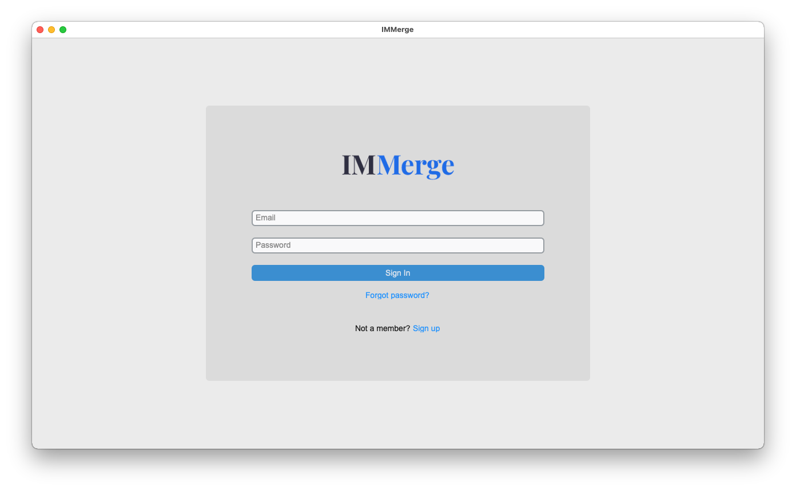

Sign in to your account using your email address and password.

### Import Data

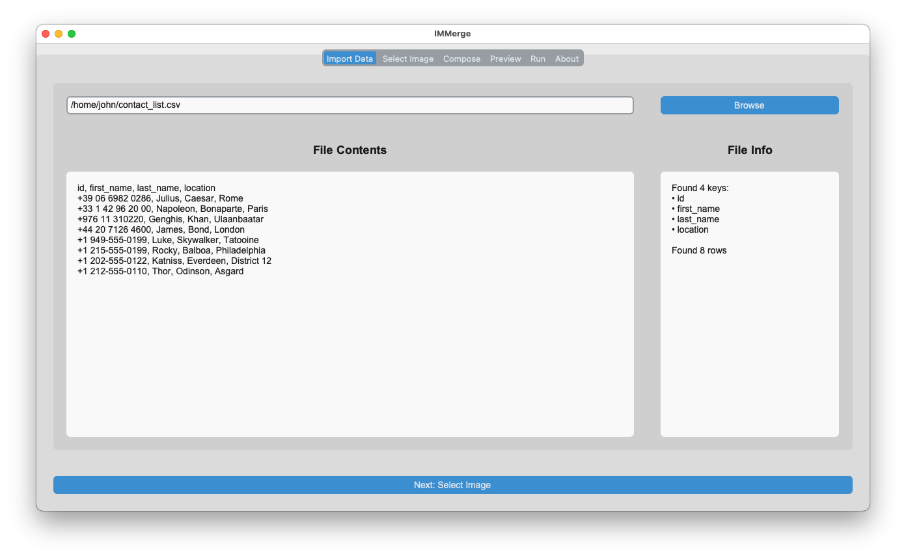

Under the `Import Data` tab, click on `Browse` and select your contact list CSV file.

### Select Image

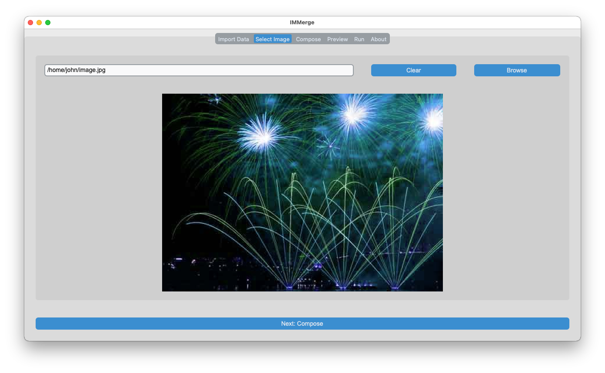

Optionally, select an image using the `Select Image` tab. `.jpg`, `.jpeg` and `.png` files are supported.

### Compose

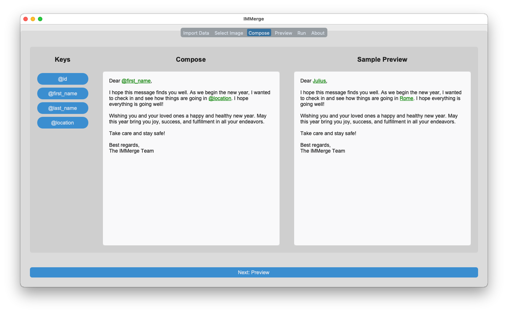

Under the `Compose` tab:

1. Compose your message in the `Compose` box
2. Use the buttons under `Keys` to add personalisation tags e.g. `@first_name`
3. Preview the personalised message (for the first contact) in the `Sample Preview` box

### Preview

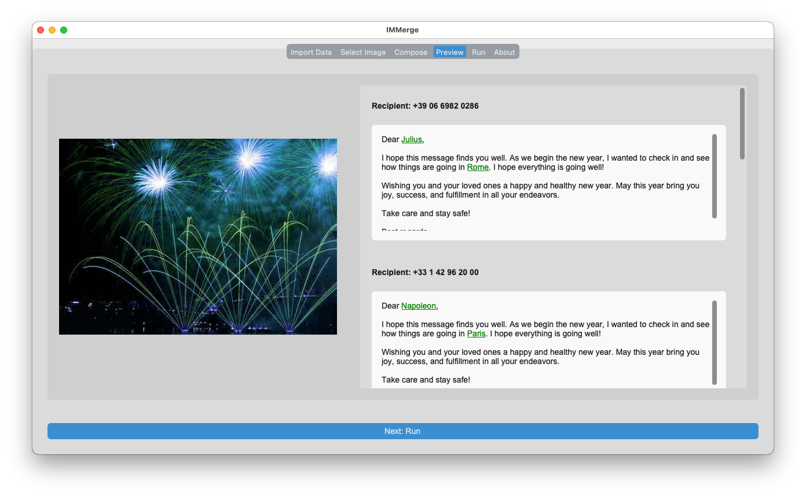

Use the `Preview` tab to preview personalised messages for each of your contacts.

### Run

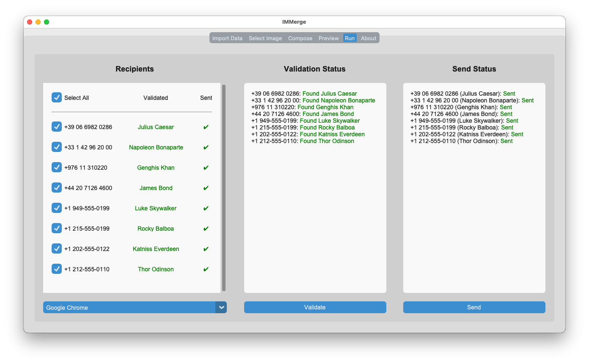

Under the `Run` tab:

1. Select recipients by checking the checkboxes
2. Select the preferred browser using the dropdown
3. Optionally, click on the `Validate` button to validate recipients (this opens a browser window to WhatsApp Web, see step 4)
4. When you are ready to send the messages, click on the `Send` button
5. Wait for a browser window to open and navigate to WhatsApp Web
6. Follow the instructions to sign in to WhatsApp Web
7. IMMerge will assume control of the browser window to send the personalised messages

> **Tip**: As a final preview, we recommend sending the message to yourself. You can do this by adding yourself to the contact list e.g. at the top, and only selecting yourself as the recipient.

## Data Privacy

IMMerge is designed to ensure that your data remains safe and secure.

When you use IMMerge, nothing is sent or stored on our servers. All data is processed locally on your computer, and we do not have access to your contact lists or messages.

IMMerge does not collect any personal information from our users, and we do not share or sell any data to third-party companies.

Our commitment to privacy means that you can use IMMerge with confidence, knowing that your data is always secure.

## Support and Enquiries

If you have any questions or issues with IMMerge, please feel free to contact us at [immerge@gazelleengineering.com](mailto:immerge@gazelleengineering.com). We are always happy to help and will do our best to respond to your enquiry as soon as possible.

If you would like to provide feedback or suggest new features for IMMerge, please drop us a message at [immerge@gazelleengineering.com](mailto:immerge@gazelleengineering.com). We are constantly working to improve our application and welcome any suggestions or ideas you may have.

For general information about IMMerge, including pricing and subscription options, please visit our website at <https://immerge.gazelleengineering.com>.

## Setup for Windows Users

Windows Defender might flag IMMerge as malware as you download the file. [Please read our section on why this happens.](#note-on-antivirus-software)

If you are downloading IMMerge from the [official release repository](https://github.com/gazelleengineering/IMMerge/releases), you can safely allow Windows Defender to let IMMerge run.

> **Important**: Only trust the IMMerge if it was downloaded from the [official release repository](https://github.com/gazelleengineering/IMMerge/releases)

### Case 1: Windows Defender SmartScreen Pop-up

You might see the following pop-up appear when you first try to run IMMerge:

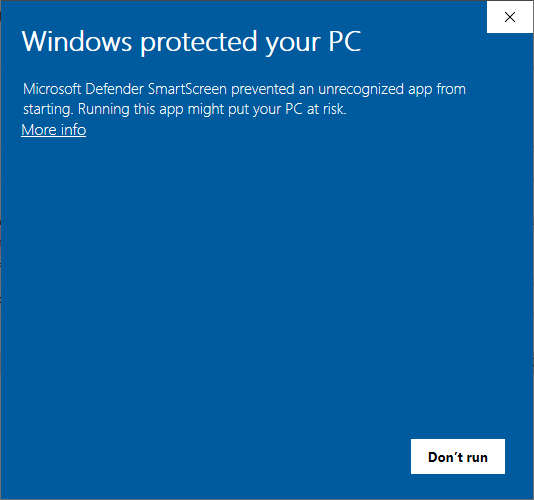

To solve this:

1. Ensure IMMerge was downloaded from the [official release repository](https://github.com/gazelleengineering/IMMerge/releases)
2. Click on `More info` in the pop-up
3. Click on `Run anyway`

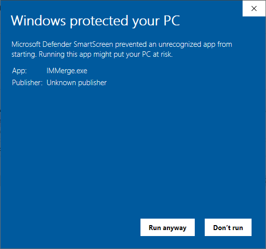

### Case 2: Windows Defender Settings

Windows Defender might also prevent IMMerge from working. To solve this:

1. Ensure IMMerge was downloaded from the [official release repository](https://github.com/gazelleengineering/IMMerge/releases)
2. Open the `Windows Security` app
3. Click on `Virus & threat protection`
4. Click on [`Protection history`](https://support.microsoft.com/windows/protection-history-f1e5fd95-09b4-46d1-b8c7-1059a1e09708)
5. Click on the card that applies to IMMerge, and select `Allow` in the `Actions` dropdown menu
6. The application should be restored to its downloaded location
7. Double-click IMMerge to run

## Setup for macOS Users

IMMerge is not distributed through the App Store, so macOS users may see a warning when running IMMerge.

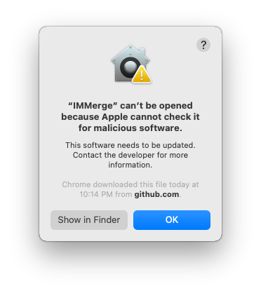

This does not mean that IMMerge is unsafe or contains malicious code.

If IMMerge was downloaded from the [official release repository](https://github.com/gazelleengineering/IMMerge/releases), the warning can be safely dismissed.

> **Important**: Only trust the IMMerge if it was downloaded from the [official release repository](https://github.com/gazelleengineering/IMMerge/releases)

### Option 1: Control-click to Open

1. Ensure IMMerge was downloaded from the [official release repository](https://github.com/gazelleengineering/IMMerge/releases)
2. Control-click on the IMMerge icon and select `Open`

    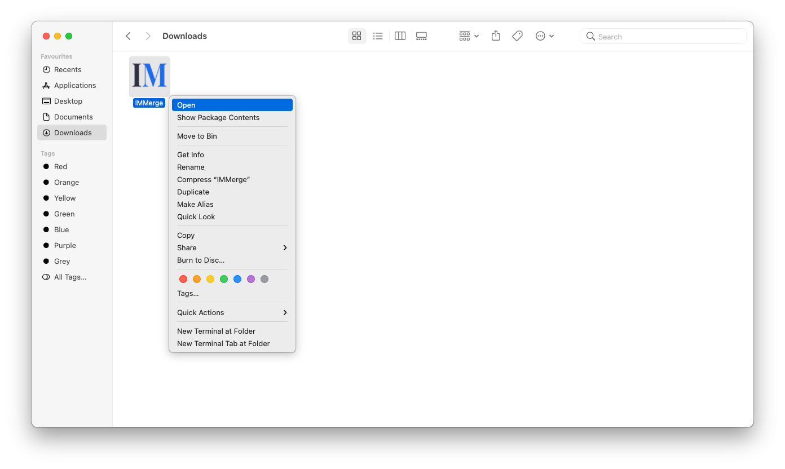
3. The warning pop-up will now show an additional `Open` button

    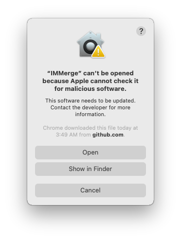
4. Click on open

### Option 2: macOS User Guide

[Control-click to open](#option-1-control-click-to-open) might not work on all versions of macOS. The [macOS User Guide](https://support.apple.com/guide/mac-help/mchleab3a043) contains a more complete list of solutions.

1. Ensure IMMerge was downloaded from the [official release repository](https://github.com/gazelleengineering/IMMerge/releases)
2. Visit the [macOS User Guide](https://support.apple.com/guide/mac-help/mchleab3a043)
3. Select your OS version
4. Follow the steps listed

### Option 3: Resolve Using the Terminal

Alternatively, the warning can be removed using the `Terminal`:

1. Ensure IMMerge was downloaded from the [official release repository](https://github.com/gazelleengineering/IMMerge/releases)
2. Open the Finder app and navigate to where you downloaded the IMMerge app bundle e.g. the `Downloads` folder
3. Control-click on the IMMerge icon and select `New Terminal at Folder` 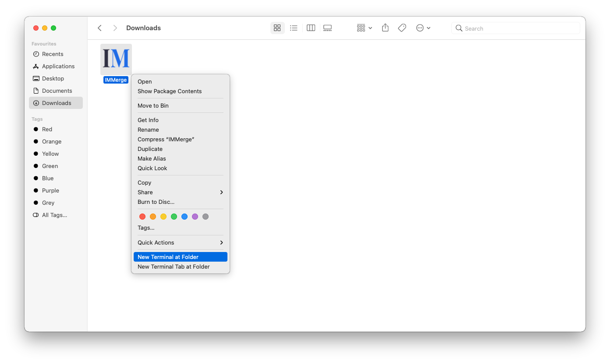
4. Copy the following command into the terminal, and press enter:

    ```shell
    xattr -r -d com.apple.quarantine .
    ```

    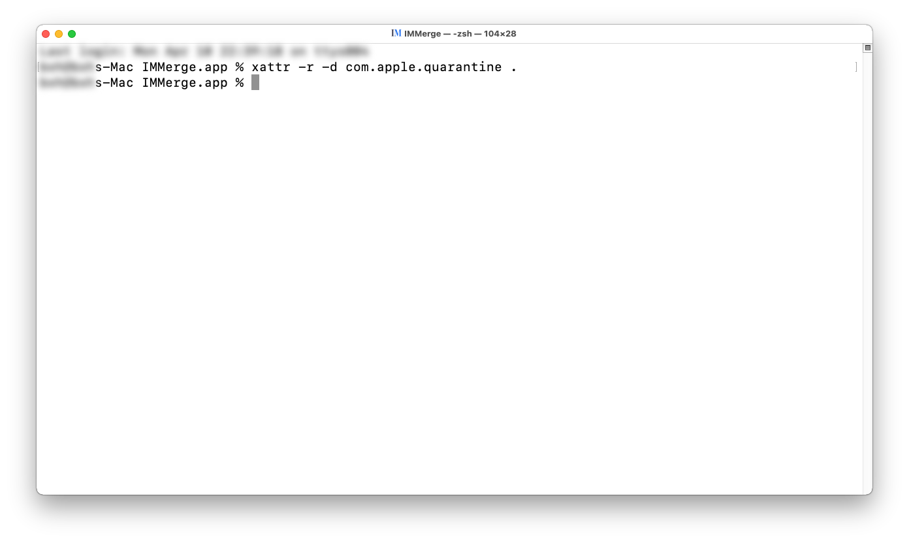
5. Double-click IMMerge to run


## Setup for Linux Users

Linux users may need to perform additional steps for IMMerge to operate as intended.

### xclip

The `xclip` package may be required. To install, run `sudo apt install xclip`.

### copyq

The `copyq` package may be required. To install, run:

```shell
sudo add-apt-repository ppa:hluk/copyq
sudo apt update
sudo apt install copyq
```

To start the `copyq` server, run the command `copyq` in the terminal.

### Firefox Snap Package

IMMerge uses [`geckodriver`](https://github.com/mozilla/geckodriver) for Firefox support. If Firefox was installed as a Snap package, e.g. in Ubuntu 22.04 and newer, there is a known issue that prevents `geckodriver` from working out of the box.

To get IMMerge working, either:

* Reinstall Firefox as a `.deb` package
* Use another [supported browser](#supported-web-browsers)
* For our more saavy users, please consider the [workarounds](https://firefox-source-docs.mozilla.org/testing/geckodriver/Usage.html#Running-Firefox-in-an-container-based-package)
